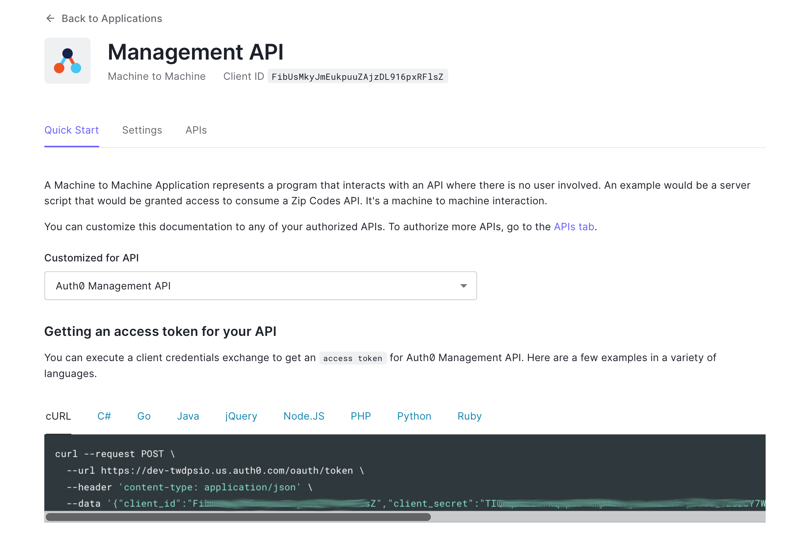

## Auth0 tenant configuration

Auth0 plays an important role in enabling a platform cli to use github and github team membership for authentication and authorization with a delivery platform. While a critical component, it is also a fairly narrow slice of the overall flow.  

In this use case, the idp plays a limited, pass-through function. When the development user uses the cli to `login`, auth0 coordinates the pass-through to Github for authentication, and it fetches the users 'claims' in the form of their team memberships within the Github organization. These are inserted into the returned id-token, but that is it. Each individual use of the resulting token involves completely seperate authorization automation depending on the target of the request.  

Because of this, the amount of configuration and the resulting testing is also quite limited. And, since the authenication workflow reuqires human interaction by design, while the configuration of the idp is automated there is a limited amount of automated testing that can used to validate the resulting idp Client. Mostly, when changes to the configuration are needed, the changes are pushed to the dev-tenant and then human interactive testing is used to validate the results.  

Create both dev and production oauth-app in your github organization. This example relates to the labs dpsctl cli so it will refer to the oauth-apps as dev-dpsctl and dpsctl (for prod).  

#### Create Social Connection to Github.com

_note. Not yet found a way to use auth0 management api for creation of social connections_

Create social connection for each tenant, use the dev-dpsctl github oauth-app credentials for the dev auth0 tenant, and the dpsctl github oauth-app credentials for the production tenant.  

  

Use the following claims with the client-id and client-secret for the respective tenant.  

  

#### Bootstrap Management API client

Go to the applications dashboard and create a new client.  

  

Set name to `Management API` and choose Machine-to-Machine-Application and the app type.  

  

Choose `Auth0 Management API` as the authorized API.  

  

Under Permissions choose `Select: All` and click `Authorize`  

  

From the example window, copy the client_id and client_secret.  

  

Lab members see maintainers notes [here](https://github.com/ThoughtWorks-DPS/documentation-internal/blob/main/doc/maintainers.md).
